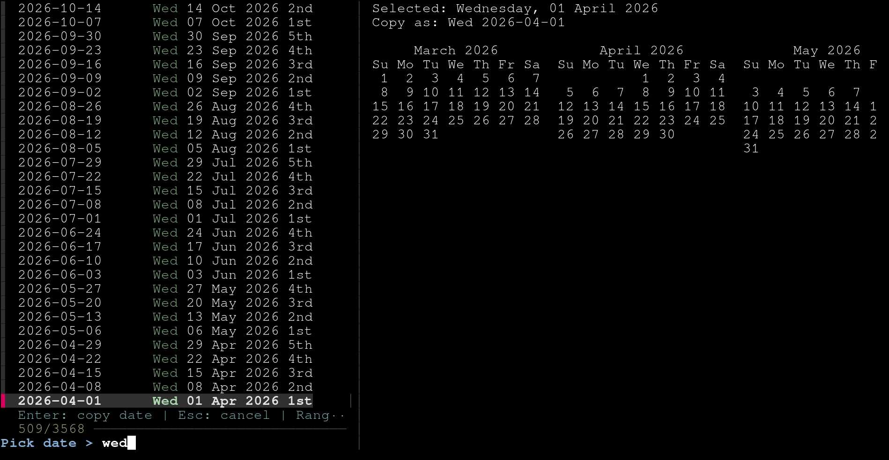

# terminal-date-picker

A small `fzf`-based terminal date picker that writes the selected date to stdout and copies it to your clipboard.



## Features

- Fuzzy search dates as you type, for example `Wednesday` to narrow the list to Wednesdays.
- See which occurrence of the weekday a date is, such as `1st`, `2nd`, or `4th` Wednesday of the month.
- Preview the selected date in context with a three-month calendar view.
- Write the selected date to stdout in `Thu 2026-03-26` format.
- Copy the selected date to the clipboard when a supported tool is available.
- Limit the picker to a custom year range when needed.

## Getting started

### Install packages

Requirements:

- `bash`
- `python3`
- `fzf`
- Clipboard support:
  - Linux: `wl-copy`, `xclip`, or `xsel`
  - macOS: `pbcopy` is built in
  - Termux: optional `termux-clipboard-set` (from `termux-api`)

If no supported clipboard tool is available, `pick-date` still works and writes the selected date to standard output.

#### Linux

Install the required packages with your package manager:

```bash
# Debian/Ubuntu
sudo apt install bash python3 fzf wl-clipboard
```

```bash
# Arch Linux
sudo pacman -S bash python fzf wl-clipboard
```

If you are on X11 instead of Wayland, install `xclip` or `xsel` instead of `wl-clipboard`.

#### macOS

Install dependencies with Homebrew:

```bash
brew install bash python fzf
```

`pbcopy` is included on macOS, so no extra clipboard package is required.

#### Termux (Android)

Install [Termux](https://f-droid.org/en/packages/com.termux/) from [F-Droid](https://f-droid.org/). The Google Play Store version is outdated.

Then install dependencies inside Termux:

```bash
pkg install bash python fzf
```

Optional clipboard integration:

```bash
pkg install termux-api
```

If you also want Android clipboard access, install [Termux:API](https://f-droid.org/en/packages/com.termux.api/) from F-Droid as well. Both apps must come from the same source to work together.

Without `Termux:API`, the picker still writes the selected date to standard output and you can copy it using the terminal's normal text selection flow. You can also use `pick-date --print-only`.

## Install date picker

After installing the dependencies above, install the script into a directory that is on your `PATH`.

Per-user:

```bash
mkdir -p ~/.local/bin
install -m 755 pick-date.sh ~/.local/bin/pick-date
```

System-wide:

```bash
sudo install -m 755 pick-date.sh /usr/local/bin/pick-date
```

Run it from anywhere:

```bash
pick-date
```

If `~/.local/bin` is not on your `PATH`, add this to your shell profile:

```bash
export PATH="$HOME/.local/bin:$PATH"
```
